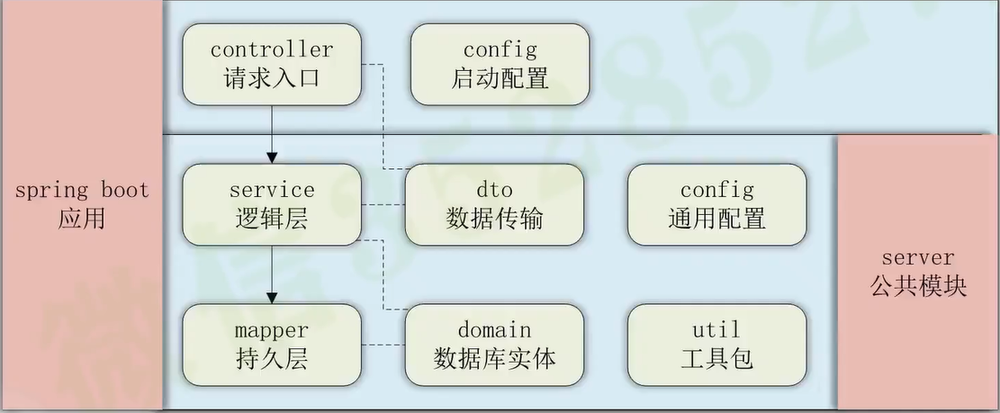

## 集成mybatis

创建数据库courseimooc，创建test表，字段为id 和name

加入依赖：在父模块的dependencyManagement标签下添加，然后在子模块添加一遍，可以去掉版本号。
```xml
<!-- 集成mybatis -->
<dependency>
	<groupId>org.mybatis.spring.boot</groupId>
	<artifactId>mybatis-spring-boot-starter</artifactId>
	<version>1.3.2</version>
</dependency>
<dependency>
	<groupId>mysql</groupId>
	<artifactId>mysql-connector-java</artifactId>
	<version>5.1.37</version>
</dependency>
```

增加数据库连接配置：
```properties
spring.datasource.url=jdbc:mysql://localhost:3306/health?useSSL=false&useUnicode=true&characterEncoding=utf-8&serverTimezone=Asia/Shanghai&allowPublicKeyRetrieval=true
spring.datasource.username=root
spring.datasource.password=root
spring.datasource.driver-class-name=com.mysql.jdbc.Driver
```
测试：

增加domain：
```java
public class Test implements Serializable {
    private Integer id;
    private String name;
    
    ...... get and set
 }
```
增加mapper：
```java
public interface TestMapper {
    public List<Test> list();
}
```

resource新建mapper文件夹：
```xml
<?xml version="1.0" encoding="UTF-8" ?>
<!DOCTYPE mapper PUBLIC "-//mybatis.org//DTD Mapper 3.0//EN" "http://mybatis.org/dtd/mybatis-3-mapper.dtd" >
<mapper namespace="cn.ishangit.TestMapper" >

    <select id="list" resultType="cn.ishangit.Test">
        select `id`, `name` from `test`
    </select>

</mapper>
```
启动类添加mapperScan 扫描mapper：
```java
@MapperScan("cn.ishangit.system.mapper")
```
增加mapper.xml路径配置：
```properties
mybatis.mapper-locations=classpath:/mapper/*.xml
```
增加service以及controller（省略）


## 优化

### 设置idea连接数据库插件：

点击右边的Database，输入信息连接mysql，需要如图进行设置时区才能连接成功。


好处：
在mapper.xml中编写sql文件有提示
在idea中创建sql文件，里面的sql语句可以右键直接执行

### 集成热部署
1.新增依赖：
```xml
 <!-- 热部署DevTools -->
<dependency>
    <groupId>org.springframework.boot</groupId>
    <artifactId>spring-boot-devtools</artifactId>
</dependency>
```
2.在设置中搜索compiler，如图勾选（代码编写时自动编译）

3.运行时自动编译，按两下shift,搜索registry,勾选第一项


### 优化mybatis日志
增加配置：
```properties
logging.level.cn.ishangit.system.mapper=trace
```

## 新建server模块
因为是被其他项目依赖，去掉eureka-client依赖，去掉启动类，将system项目中的其他内容移动到server中，

将server 的依赖加入父pom，将去掉版本号的依赖加入system

修改system 的主类的mapper扫描

在server项目resource新建config文件夹，将system 的application配置文件放入，改造（去掉端口号等，修改mybatis日志打印信息的包名）

在system主类增加`@ComponentScan("cn.ishangit")`

最终的调用流程：


> 遇到的问题： 
> system主类没有加componentsan注解，导致扫描不到server包中的类，在注入service 的时候会报没有这个bean的错误。

## 集成mybatis generator
1.父pom中加入maven插件
```xml
<!-- mybatis generator 自动生成代码插件 -->
<plugin>
	<groupId>org.mybatis.generator</groupId>
	<artifactId>mybatis-generator-maven-plugin</artifactId>
	<version>1.3.7</version>
	<configuration>
		<configurationFile>src/main/resources/generator/generatorConfig.xml</configurationFile>
		<overwrite>true</overwrite>
		<verbose>true</verbose>
	</configuration>
	<dependencies>
		<dependency>
			<groupId>mysql</groupId>
			<artifactId>mysql-connector-java</artifactId>
			<version>5.1.47</version>
		</dependency>
	</dependencies>
</plugin>
```
2.添加generatorConfig.xml
```xml
<?xml version="1.0" encoding="UTF-8"?>
<!DOCTYPE generatorConfiguration
        PUBLIC "-//mybatis.org//DTD MyBatis Generator Configuration 1.0//EN"
        "http://mybatis.org/dtd/mybatis-generator-config_1_0.dtd">

<generatorConfiguration>
    <context id="Mysql" targetRuntime="MyBatis3" defaultModelType="flat">

        <property name="beginningDelimiter" value="`"/>
        <property name="endingDelimiter" value="`"/>

        <!-- 生成的实体类添加toString()方法 -->
        <plugin type="org.mybatis.generator.plugins.ToStringPlugin" />

        <!-- 不生成注释 -->
        <commentGenerator>
            <property name="suppressAllComments" value="true"/>
        </commentGenerator>

        <jdbcConnection driverClass="com.mysql.jdbc.Driver"
                        connectionURL="jdbc:mysql://localhost:3306/courseimooc"
                        userId="courseimooc@localhost"
                        password="root">
        </jdbcConnection>

        <!-- domain类的位置 -->
        <javaModelGenerator targetProject="src\main\java"
                            targetPackage="com.course.server.domain"/>

        <!-- mapper xml的位置 -->
        <sqlMapGenerator targetProject="src\main\resources"
                         targetPackage="mapper"/>

        <!-- mapper类的位置 -->
        <javaClientGenerator targetProject="src\main\java"
                             targetPackage="com.course.server.mapper"
                             type="XMLMAPPER" />

        <table tableName="test" domainObjectName="Test"/>
    </context>
</generatorConfiguration>
```
3.添加maven命令执行


4.解决重复生成mapper.xml代码问题
> 默认会以添加的方式向mapper.xml中生成文件，如果我们表有修改，
> 在我们在此点击生成的时候会生成重复代码

在配置文件中增加配置
```xml
<!--覆盖生成XML文件-->
<plugin type="org.mybatis.generator.plugins.UnmergeableXmlMappersPlugin" />
```
